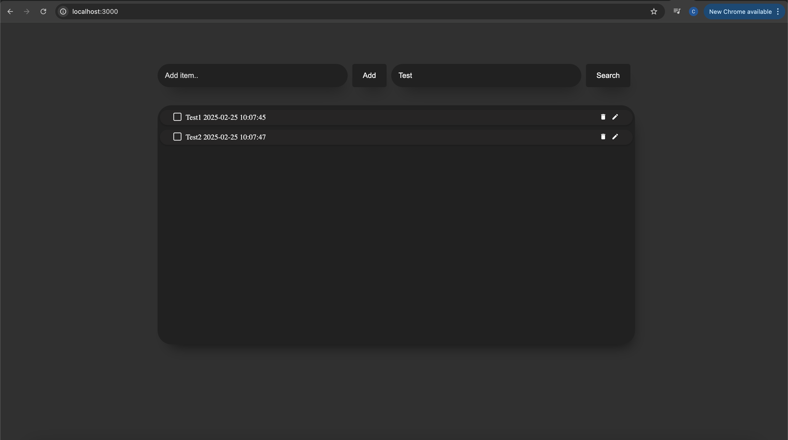

# Todo List App with Next.js and Rust

A modern, full-stack todo list application built with Next.js for the frontend and Rust with Actix Web for the backend.



## Features

- Create, read, update, and delete todo items
- Search functionality to filter todos
- Edit existing todos
- Toggle completion status
- Timestamp tracking for todo creation
- Clean and responsive UI
- Fast performance with Rust backend
- Real-time updates without page refresh

## Tech Stack

### Frontend
- **Next.js** - React framework for building the UI
- **React** - JavaScript library for building user interfaces
- **Axios** - Promise-based HTTP client for API requests
- **date-fns** - Date utility library for formatting dates
- **React Icons** - Icon library for UI elements

### Backend
- **Rust** - Systems programming language for building the API
- **Actix Web** - Web framework for Rust
- **Serde** - Serialization/deserialization framework
- **UUID** - For generating unique IDs
- **Chrono** - Date and time library for Rust

## Getting Started

### Prerequisites
- Node.js (>= 14.x)
- npm or yarn
- Rust (>= 1.54.0)
- Cargo (Rust package manager)

### Installation

1. **Clone the repository**
   ```bash
   git clone https://github.com/yourusername/todo-list-app.git
   cd todo-list-app
   ```

2. **Install frontend dependencies**
   ```bash
   npm install
   # or
   yarn install
   ```

3. **Run the backend server**
   ```bash
   cd rust
   cargo run
   ```
   This will start the Rust backend server on http://127.0.0.1:8080

4. **Run the frontend development server**
   ```bash
   # From the project root
   npm run dev
   # or
   yarn dev
   ```
   This will start the Next.js development server on http://localhost:3000

## API Endpoints

- `GET /todos` - Get all todos
- `POST /todos` - Create a new todo
- `PUT /todos/{id}` - Update a todo by ID
- `DELETE /todos/{id}` - Delete a todo by ID

## Future Improvements

- [ ] User authentication
- [ ] Todo categories/tags
- [ ] Due dates for todos
- [ ] Priority levels
- [ ] Persistent storage with a database
- [ ] Dark/light theme toggle
- [ ] Multi-user support
- [ ] Mobile app version
